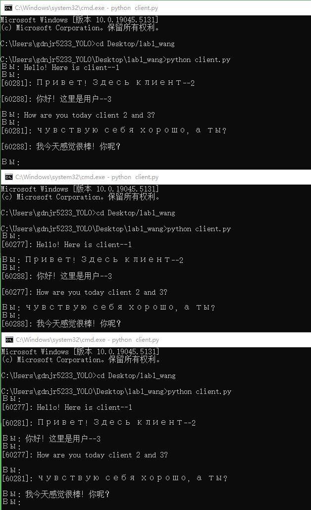

# __Лаб №2 - Работа с сокетами__

__Группа:D3310__  &nbsp;&nbsp;&nbsp;&nbsp; __Студент: Ван ЦзыНин__

[TOC]

## Введение

В рамках данной лабораторной работы мы рассмотрели основы работы с сокетами для создания простого многопользовательского чата. Сокеты используются для установления соединений между клиентами и серверами, что является основой сетевого взаимодействия в современных приложениях.

## Описание реализации

### Сервер

Серверная часть реализована с использованием стандартного модуля `socket` и `threading` для многозадачности. Сервер слушает указанный порт и обрабатывает соединения от нескольких клиентов, пересылая полученные сообщения всем подключенным пользователям.

### Клиент

Клиентская часть подключается к серверу и позволяет пользователю отправлять сообщения. Для обеспечения параллельной работы клиент принимает сообщения в одном потоке, а в другом потоке отправляет сообщения на сервер.

### Многозадачность

Для обработки нескольких клиентов одновременно используется модуль `threading`, который позволяет серверу и клиентам работать в многозадачном режиме. Каждый новый клиент обрабатывается в отдельном потоке.

## Выполнения

Кода сервера для многопользовательского чата
```python
import socket
import threading

# 定义全局变量
clients = []

# 处理客户端连接的函数
def handle_client(client_socket, client_address):
    print(f"[INFO] Клиент подключен: {client_address}")
    clients.append((client_socket, client_address))
    
    while True:
        try:
            message = client_socket.recv(1024).decode("utf-8")
            if message:
                print(f"[Cообщение от {client_address}]: {message}")
                broadcast(message, client_address)
        except:
            print(f"[Отключение клиента]: {client_address}")
            clients.remove((client_socket, client_address))
            client_socket.close()
            break

# 广播消息的函数
def broadcast(message, sender_address):
    for client_socket, client_address in clients:
        if client_address != sender_address:  # 不发送给消息的发送者
            try:
                client_socket.send(f"\n[{sender_address[1]}]: {message}".encode("utf-8"))
            except:
                client_socket.close()
                clients.remove((client_socket, client_address))

# 主函数
def main():
    server = socket.socket(socket.AF_INET, socket.SOCK_STREAM)
    server.bind(("0.0.0.0", 12345))  # 监听端口
    server.listen(5)
    print("[SERVER STARTED]")
    
    while True:
        client_socket, client_address = server.accept()
        threading.Thread(target=handle_client, args=(client_socket, client_address)).start()

if __name__ == "__main__":
    main()
```

Кода клиента для многопользовательского чата
```python
import socket
import threading

# 处理接收消息的函数
def receive_messages(client_socket):
    while True:
        try:
            message = client_socket.recv(1024).decode("utf-8")
            if message:
                print(message)
        except:
            print("[Соединение закрыто]")
            client_socket.close()
            break

# 主函数
def main():
    client = socket.socket(socket.AF_INET, socket.SOCK_STREAM)
    client.connect(("127.0.0.1", 12345))  # 连接到服务器

    threading.Thread(target=receive_messages, args=(client,)).start()
    
    while True:
        message = input("Вы: ")
        if message.lower() == "exit":
            client.close()
            break
        client.send(message.encode("utf-8"))

if __name__ == "__main__":
    main()
```

## Интерфейс сервера


## Интерфейс клиента


## Заключение

Лабораторная работа помогла понять основные принципы работы с сокетами и многозадачностью в Python. Эти знания являются основой для создания более сложных сетевых приложений.
