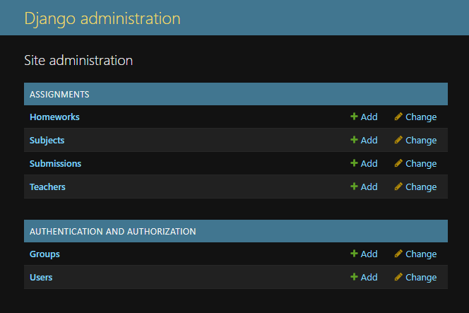
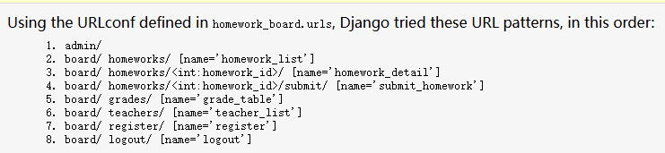
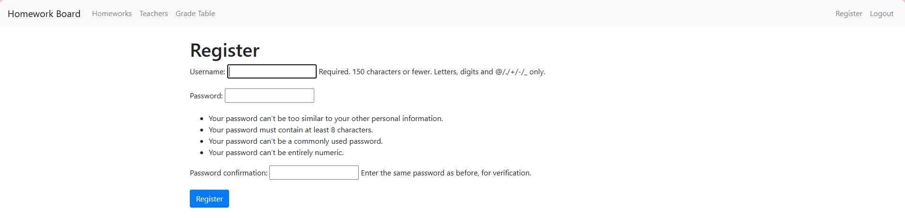
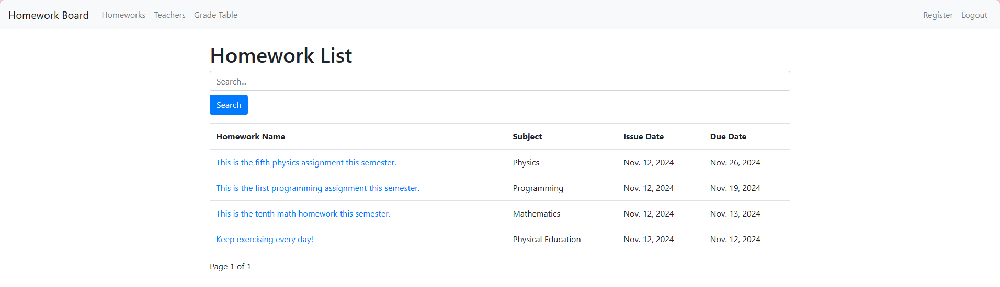
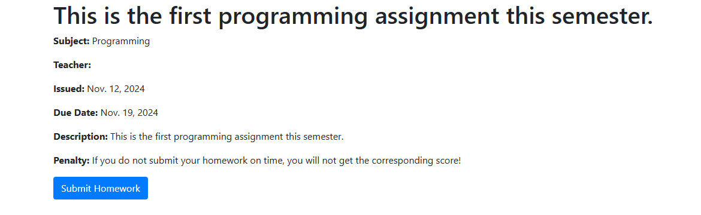
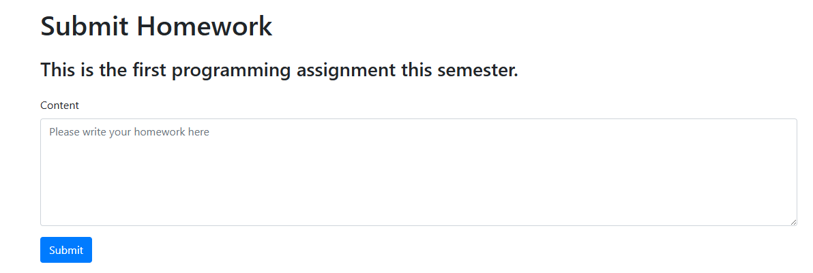
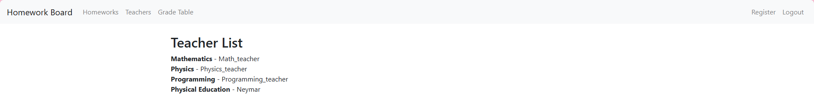
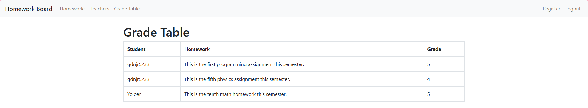

# __Лаб №2 - Реализация простого сайта на django__
## __Вариант 2 - Доска домашних заданий__

__Группа:D3310__  &nbsp;&nbsp;&nbsp;&nbsp; __Студент: Ван ЦзыНин__

[TOC]

## Цели работы

Овладеть практическими навыками и умениями реализации web-сервисов средствами Django и базы данных PostgreSQL.

## Задания

Создание Доски домашних заданий с возможностями, включая:

1) Предмет

2) Преподавателя

3) Дату выдачи

4) Срок выполнения

5) Текст задания

6) Информацию о штрафах

7) Регистрация новых пользователей

8) Просмотр домашних заданий с отображением сроков выполнения и описания

9) Сдача домашних заданий в текстовом виде через интерфейс сайта

10) Оценка заданий администратором (учителем) через Django-admin

11) Формирование таблицы успеваемости для отображения всех оценок учеников

## Реализация
### Основные модели

В проекте реализованы следующие модели:

__Subject (Предмет)__:

- Название предмета

- Привязка к преподавателю

__Teacher (Преподаватель)__:

- Имя

- Привязка к дисциплинам

__Homework (Домашнее задание)__:

- Предмет

- Преподаватель

- Дата выдачи

- Срок выполнения

- Текст задания

- Информация о штрафах

__Submission (Сдача заданий)__:

- Привязка к домашнему заданию

- Ученик

- Текст ответа

- Оценка

## Процесс выполнения
### Создание моделей

В этом разделе приведен код, который используется для создания моделей Django

```python
from django.db import models
from django.contrib.auth.models import User

class Subject(models.Model):
    name = models.CharField(max_length=100)

    def __str__(self):
        return self.name


class Teacher(models.Model):
    user = models.OneToOneField(User, on_delete=models.CASCADE)
    subject = models.ForeignKey(Subject, on_delete=models.CASCADE)

    def __str__(self):
        return self.user.username


class Homework(models.Model):
    subject = models.ForeignKey(Subject, on_delete=models.CASCADE)
    teacher = models.CharField(max_length=100, null=True)
    # teacher = models.ForeignKey(User, on_delete=models.CASCADE, null=True)
    issue_date = models.DateField()
    due_date = models.DateField()
    description = models.TextField()
    penalty = models.TextField(max_length=100, null=True, blank=True)

    def __str__(self):
        return f"{self.subject.name} - {self.description[:100]}"
    

class Submission(models.Model):
    homework = models.ForeignKey(Homework, on_delete=models.CASCADE)
    student = models.ForeignKey(User, on_delete=models.CASCADE)
    content = models.TextField()
    submitted_at = models.DateTimeField()
    grade = models.IntegerField(blank=True, null=True)

    def __str__(self):
        return f"{self.student.username} - {self.homework.description[:50]}"
```

### Пользовательские функции

Этот раздел демонстрирует функции, добавленные для пользователя, например: студенты сдают ДЗ 

(Для получения более подробного кода, пожалуйста, посмотрите "lab2_wang/assignments/views.py").

```python
# 学生提交作业
@login_required
def submit_homework(request, homework_id):
    homework = Homework.objects.get(id=homework_id)
    if request.method == 'POST':
        form = SubmissionForm(request.POST)
        if form.is_valid():
            submission = form.save(commit=False)
            submission.homework = homework
            submission.student = request.user
            submission.save()
            return redirect('homework_list')  # 提交作业后跳转回作业列表
    else:
        form = SubmissionForm()
    return render(request, 'submit_homework.html', {'form': form, 'homework': homework})
```

## Полученные результаты
### Скриншоты интерфейсов

## Интерфейс администрирования django


## Интерфейс URL patterns


## Интерфейс Register


## Интерфейс Homework list


## Интерфейс Homework details


## Интерфейс Submit homework


## Интерфейс Grade table


## Интерфейс Homework details


## Выводы

В ходе выполнения Лаб №2 я:

1) Освоил основы работы с Django, включая модели, маршруты и формы.

2) Научился интегрировать PostgreSQL в Django проект.

3) Реализовал функционал доски домашних заданий, соответствующий требованиям задания.

4) Получил практический опыт работы с административной панелью Django.

5) Научился использовать Markdown и MkDocs для подготовки отчетов.
