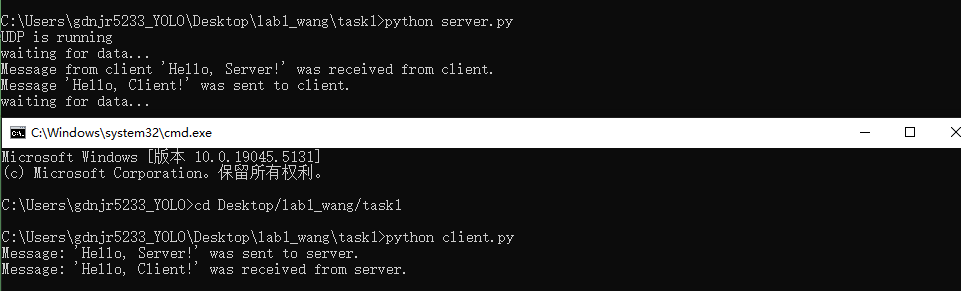
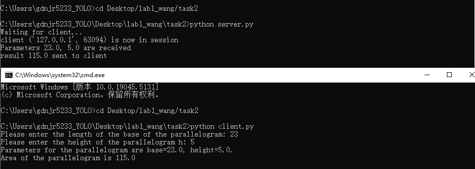
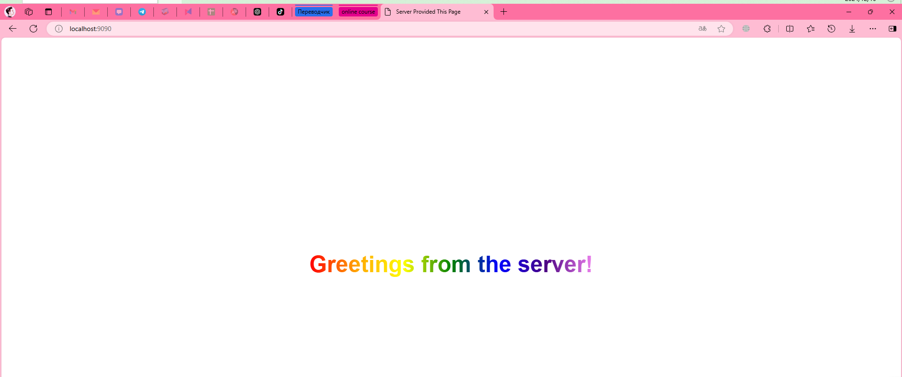
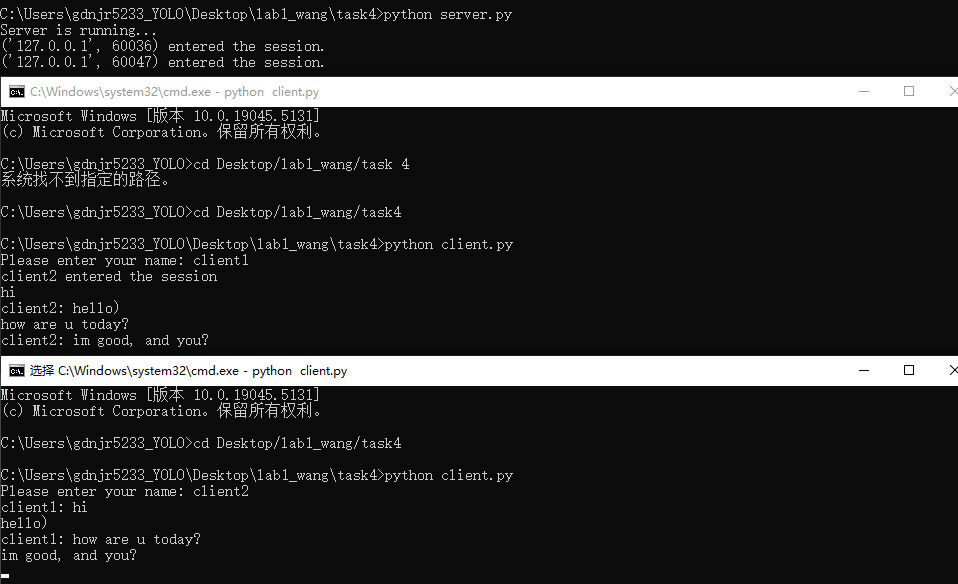
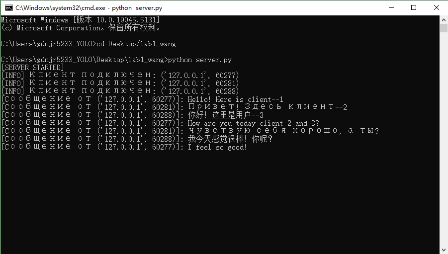

# __Лаб №1 - Работа с сокетами__

__Группа:D3310__  &nbsp;&nbsp;&nbsp;&nbsp; __Студент: Ван Цзынин__

[TOC]

## Введение
В рамках данной лабораторной работы мы рассмотрели основы работы с сокетами для создания простого многопользовательского чата. Сокеты используются для установления соединений между клиентами и серверами, что является основой сетевого взаимодействия в современных приложениях.

## Описание реализации
### Сервер
Серверная часть реализована с использованием стандартного модуля `socket` и `threading` для многозадачности. Сервер слушает указанный порт и обрабатывает соединения от нескольких клиентов, пересылая полученные сообщения всем подключенным пользователям.

### Клиент
Клиентская часть подключается к серверу и позволяет пользователю отправлять сообщения. Для обеспечения параллельной работы клиент принимает сообщения в одном потоке, а в другом потоке отправляет сообщения на сервер.

### Многозадачность
Для обработки нескольких клиентов одновременно используется модуль `threading`, который позволяет серверу и клиентам работать в многозадачном режиме. Каждый новый клиент обрабатывается в отдельном потоке.

## Выполнения
### task1
Реализовать клиентскую и серверную часть приложения. Клиент отправляет серверу сообщение «Hello, server», и оно должно отобразиться на стороне сервера. В ответ сервер отправляет клиенту сообщение «Hello, client», которое должно отобразиться у клиента.

task1_server.py
```python
from socket import *


server_socket = socket(AF_INET, SOCK_DGRAM)
server_address = ('localhost', 9090)

server_socket.bind(server_address)

print("UDP is running")

while True:
    print("waiting for data...")
    data, client_address = server_socket.recvfrom(1024)
    if not data:
        break
    print(f"Message from client '{data.decode()}' was received from client.", flush=True)

    response = "Hello, Client!"
    server_socket.sendto(response.encode(), client_address)
    print(f"Message '{response}' was sent to client.")

server_socket.close()
```

task1_client.py
```python
from socket import *


client_socket = socket(AF_INET, SOCK_DGRAM)

data_for_server = "Hello, Server!"

client_socket.sendto(data_for_server.encode(), ('localhost', 9090))
print(f"Message: '{data_for_server}' was sent to server.")

data_from_server, addr = client_socket.recvfrom(1024)
print(f"Message: '{data_from_server.decode()}' was received from server.")
```
### task1_screenshot


---

### task2
Реализовать клиентскую и серверную часть приложения. Клиент запрашивает выполнение математической операции, параметры которой вводятся с клавиатуры. Сервер обрабатывает данные и возвращает результат клиенту.

task2_server.py
```python
from socket import *
import time


def parallelogram_area(a, h):
    return a * h

server_socket = socket(AF_INET, SOCK_STREAM)
server_socket.bind(('localhost', 9090))
server_socket.listen(1)

print("Waiting for client...")

while True:
    connection, addr = server_socket.accept()
    try:
        time.sleep(3)
        print(f"client {addr} is now in session")
        data = connection.recv(1024).decode()
        if data:
            base, height = map(float, data.split())
            print(f"Parameters {base}, {height} are received")
            area = parallelogram_area(base, height)

            connection.sendall(str(area).encode())
            print(f"result {area} sent to client")
    finally:
        connection.close()
```

task2_client.py
```python
from socket import *


client_socket = socket(AF_INET, SOCK_STREAM)
client_socket.connect(('localhost', 9090))

try:
    base = float(input("Please enter the length of the base of the parallelogram: "))
    height = float(input("Please enter the height of the parallelogram h: "))
    print(f"Parameters for the parallelogram are base={base}, height={height}.")
    message = f"{base} {height}"
    client_socket.sendall(message.encode())

    data = client_socket.recv(1024).decode()
    print(f"Area of the parallelogram is {data}")

finally:
    client_socket.close()
```
### task2_screenshot


---

### task3
Реализовать серверную часть приложения. Клиент подключается к серверу, и в ответ получает HTTP-сообщение, содержащее HTML-страницу, которая сервер подгружает из файла index.html.

task3_server.py
```python
from socket import *
import os

# 获取当前文件所在的目录
current_dir = os.path.dirname(os.path.abspath(__file__))
html_file_path = os.path.join(current_dir, 'index.html')

# 确保 HTML 文件存在
if not os.path.exists(html_file_path):
    raise FileNotFoundError(f"HTML file not found at: {html_file_path}")

# 创建服务器套接字
server_socket = socket(AF_INET, SOCK_STREAM)
server_socket.bind(('localhost', 9090))
server_socket.listen(1)

print("Server is running...")
print("http://localhost:9090")

while True:
    connection, client_address = server_socket.accept()
    try:
        print(f"Client: {client_address} is now in session.")

        # 接收客户端请求
        request = connection.recv(1024).decode()
        print(f"Client request: \n{request}")

        # 读取 HTML 文件内容
        with open(html_file_path, 'r', encoding='utf-8') as file:
            html_content = file.read()

        # 创建 HTTP 响应
        response = f"""HTTP/1.1 200 OK
Content-Type: text/html
Content-Length: {len(html_content)}

{html_content}"""

        # 发送响应
        connection.sendall(response.encode())
        print("Response is sent to a client.")
    finally:
        connection.close()
        print(f"Connection with client {client_address} is closed.")
```
### task3_screenshot


---

### task4
Реализовать двухпользовательский или многопользовательский чат. Для максимального количества баллов реализуйте многопользовательский чат.

task4_server.py
```python
from socket import *
import threading


clients = []
usernames = []

def handle_client(client_socket, address):
    print(f"{address} entered the session.")
    username = client_socket.recv(1024).decode()
    usernames.append(username)
    clients.append(client_socket)

    broadcast(f"{username} entered the session".encode(), client_socket)

    while True:
        try:
            message = client_socket.recv(1024)
            if message:
                broadcast(f"{username}: {message.decode()}".encode(), client_socket)
            else:
                remove_client(client_socket)
                break
        except:
            continue

def broadcast(message, client_socket):
    for client in clients:
        if client != client_socket:
            try:
                client.send(message)
            except:
                remove_client(client)

def remove_client(client_socket):
    if client_socket in clients:
        index = clients.index(client_socket)
        clients.remove(client_socket)
        username = usernames[index]
        usernames.remove(username)
        broadcast(f"{username} left.".encode(), client_socket)

server_socket = socket(AF_INET, SOCK_STREAM)
server_socket.bind(('localhost', 9090))
server_socket.listen(5)
print("Server is running...")

while True:
    client_socket, address = server_socket.accept()
    threading.Thread(target=handle_client, args=(client_socket, address)).start()
```

task4_client.py
```python
from socket import *
import threading


def receive_messages(client_socket):
    while True:
        try:
            message = client_socket.recv(1024).decode()
            if message:
                print(message)
            else:
                break
        except:
            print("unable to send message")
            client_socket.close()
            break

client_socket = socket(AF_INET, SOCK_STREAM)
client_socket.connect(('localhost', 9090))

threading.Thread(target=receive_messages, args=(client_socket,)).start()

username = input("Please enter your name: ")
client_socket.send(username.encode())

while True:
    message = input()
    if message.lower() == 'exit':
        break
    client_socket.send(message.encode())

client_socket.close()
```
### task4_screenshot


---

### task5
Написать простой веб-сервер для обработки GET и POST HTTP-запросов с помощью библиотеки socket в Python.

task5_server.py
```python
import socket
import threading


HOST = 'localhost'
PORT = 9090
grouped_grades = {}


def handle_client(connection, address):
    request = connection.recv(1024).decode()
    parts = request.split(' ')
    if len(parts) >= 3:
        method, path, protocol = parts[0:3]
        print(f"Получен {method} запрос от {address}")
        if method == 'GET':
            send_response(connection, '200 OK', 'Content-Type: text/html', provide_with_html())
        elif method == 'POST':
            content_length = int(request.split('Content-Length: ')[1].split('\r\n')[0])
            body = request.split('\r\n\r\n', 1)[1]
            while len(body.encode('utf-8')) < content_length:
                body += connection.recv(1024).decode()
            params = parse_post_data(body)
            discipline, grade = params.get('discipline', ''), params.get('grade', '')
            grouped_grades[discipline] = grouped_grades.get(discipline, []) + [grade]
            send_response(connection, '200 OK', 'Content-Type: text/plain', 'Принято!')
        else:
            send_response(connection, '405 Method is Not Allowed', 'Content-Type: text/plain',
                          'К сожалению, такого метода нет в листе разрешенных, попробуйте еще раз(((((')
    else:
        send_response(connection, '400 Bad Request', 'Content-Type: text/plain', 'Ошибка')
    connection.close()


def send_response(connection, status, content_type, body):
    response = f"""HTTP/1.1 {status}
{content_type}
Content-Length: {len(body)}

{body}"""
    connection.sendall(response.encode())


def parse_post_data(data):
    return {key: value.replace('+', ' ') for key, value in [pair.split('=') for pair in data.split('&')]}


def provide_with_html():
    rows = ''.join([f"<tr><td>{discipline}</td><td>{','.join(grades)}</td></tr>" for discipline, grades in grouped_grades.items()])
    return f"""<!DOCTYPE html>
<html>
<head>
    <title>Grades</title>
</head>
<body>
    <h1>Grades</h1>
    <table border="1">
        <tr><th>Discipline</th><th>Grade</th></tr>
        {rows}
    </table>
</body>
</html>"""


with socket.socket(socket.AF_INET, socket.SOCK_STREAM) as s:
    s.bind((HOST, PORT))
    s.listen()
    print("Сервер на порте", PORT)
    while True:
        connection, address = s.accept()
        thread = threading.Thread(target=handle_client, args=(connection, address))
        thread.start()
```

Код сервера для многопользовательского чата
```python
import socket
import threading

# 定义全局变量
clients = []

# 处理客户端连接的函数
def handle_client(client_socket, client_address):
    print(f"[INFO] Клиент подключен: {client_address}")
    clients.append((client_socket, client_address))
    
    while True:
        try:
            message = client_socket.recv(1024).decode("utf-8")
            if message:
                print(f"[Cообщение от {client_address}]: {message}")
                broadcast(message, client_address)
        except:
            print(f"[Отключение клиента]: {client_address}")
            clients.remove((client_socket, client_address))
            client_socket.close()
            break

# 广播消息的函数
def broadcast(message, sender_address):
    for client_socket, client_address in clients:
        if client_address != sender_address:  # 不发送给消息的发送者
            try:
                client_socket.send(f"\n[{sender_address[1]}]: {message}".encode("utf-8"))
            except:
                client_socket.close()
                clients.remove((client_socket, client_address))

# 主函数
def main():
    server = socket.socket(socket.AF_INET, socket.SOCK_STREAM)
    server.bind(("0.0.0.0", 12345))  # 监听端口
    server.listen(5)
    print("[SERVER STARTED]")
    
    while True:
        client_socket, client_address = server.accept()
        threading.Thread(target=handle_client, args=(client_socket, client_address)).start()

if __name__ == "__main__":
    main()
```

Код клиента для многопользовательского чата
```python
import socket
import threading

# 处理接收消息的函数
def receive_messages(client_socket):
    while True:
        try:
            message = client_socket.recv(1024).decode("utf-8")
            if message:
                print(message)
        except:
            print("[Соединение закрыто]")
            client_socket.close()
            break

# 主函数
def main():
    client = socket.socket(socket.AF_INET, socket.SOCK_STREAM)
    client.connect(("127.0.0.1", 12345))  # 连接到服务器

    threading.Thread(target=receive_messages, args=(client,)).start()
    
    while True:
        message = input("Вы: ")
        if message.lower() == "exit":
            client.close()
            break
        client.send(message.encode("utf-8"))

if __name__ == "__main__":
    main()
```

### task5_screenshot_Интерфейс сервера


### task5_screenshot_Интерфейс клиента


## Заключение

Лабораторная работа помогла понять основные принципы работы с сокетами и многозадачностью в Python. Эти знания являются основой для создания более сложных сетевых приложений.
