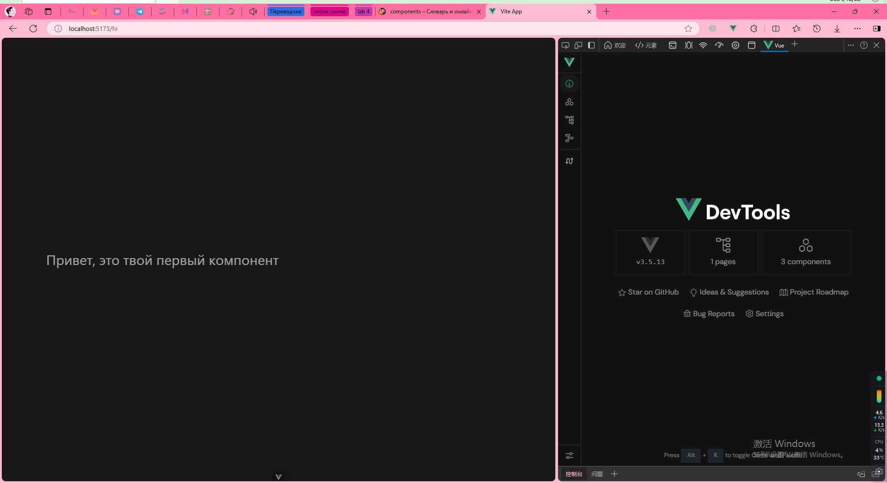
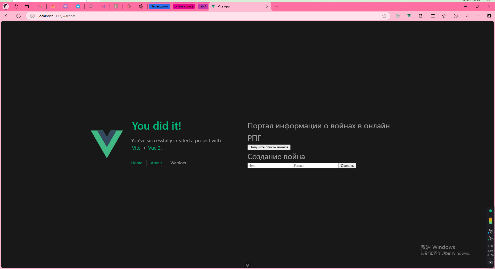

# __Лаб №4 - Реализация клиентской части средствами Vue.js__
## __Вариант 2 - Доска домашних заданий__

__Группа:D3310__  &nbsp;&nbsp;&nbsp;&nbsp; __Студент: Ван Цзынин__

[TOC]

## Реализовать документацию, описывающую работу разработанных интерфейсов

## Введение

В данной работе разрабатывается документация для веб-приложения с использованием фреймворка Vue.js и Django REST framework. Целью является создание интерфейсов, которые взаимодействуют с бэкендом через API, обеспечивая правильное взаимодействие между фронтенд и сервером. 

В ходе работы будут рассмотрены основные операции, такие как получение данных с сервера, отправка данных и обработка ошибок, а также настройка CORS для корректной работы кросс-доменных запросов.

## Описание работы интерфейсов

### 1. Основной интерфейс пользователя

Интерфейс пользователя позволяет получить список всех доступных воинов с сервера, добавлять нового воина и обновлять информацию о существующих. Все данные хранятся на сервере, и для взаимодействия с ними используются HTTP-запросы, такие как GET, POST, PUT и DELETE.

### 2. Описание API

Веб-приложение использует RESTful API, обеспечивающее доступ к данным о воинах. Основные эндпоинты API:

- **GET /warriors/list** – получает список всех воинов.
- **POST /warrior/create** – создает нового воина.
- **PUT /warrior/update/{id}** – обновляет данные о воине.
- **DELETE /warrior/delete/{id}** – удаляет воина.

### 3. Реализация интерфейсов во Vue.js

Для работы с API используется библиотека Axios, которая позволяет выполнять HTTP-запросы с клиентской стороны. Все операции с API описаны ниже.

```javascript
import axios from 'axios';

export default {
  data() {
    return {
      warriors: [],
    };
  },
  mounted() {
    this.fetchWarriors();
  },
  methods: {
    async fetchWarriors() {
      try {
        const response = await axios.get('http://example.com/api/warriors/list');
        this.warriors = response.data;
      } catch (error) {
        console.error("Ошибка при получении данных о воинах:", error);
      }
    },
    async addWarrior(warriorData) {
      try {
        const response = await axios.post('http://example.com/api/warrior/create', warriorData);
        this.warriors.push(response.data);
      } catch (error) {
        console.error("Ошибка при добавлении воина:", error);
      }
    }
  }
};
```

APP.vue
```javascript
<script setup>
import { RouterLink, RouterView } from 'vue-router'
import HelloWorld from './components/HelloWorld.vue'
</script>

<template>
  <header>
    

    <div class="wrapper">
      <HelloWorld msg="You did it!" />

      <nav>
        <RouterLink to="/">Home</RouterLink>
        <RouterLink to="/about">About</RouterLink>
        <RouterLink to="/warriors">Warriors</RouterLink> <!-- 添加导航到 Warriors 页 -->
      </nav>
    </div>
  </header>

  <RouterView />
</template>

<style scoped>
header {
  line-height: 1.5;
  max-height: 100vh;
}

.logo {
  display: block;
  margin: 0 auto 2rem;
}

nav {
  width: 100%;
  font-size: 12px;
  text-align: center;
  margin-top: 2rem;
}

nav a.router-link-exact-active {
  color: var(--color-text);
}

nav a.router-link-exact-active:hover {
  background-color: transparent;
}

nav a {
  display: inline-block;
  padding: 0 1rem;
  border-left: 1px solid var(--color-border);
}

nav a:first-of-type {
  border: 0;
}

@media (min-width: 1024px) {
  header {
    display: flex;
    place-items: center;
    padding-right: calc(var(--section-gap) / 2);
  }

  .logo {
    margin: 0 2rem 0 0;
  }

  header .wrapper {
    display: flex;
    place-items: flex-start;
    flex-wrap: wrap;
  }

  nav {
    text-align: left;
    margin-left: -1rem;
    font-size: 1rem;

    padding: 1rem 0;
    margin-top: 1rem;
  }
}
</style>
```

## Скриншоты интерфейсов

### Интерфейс VUE


### Интерфейс warriors


## Выводы

В ходе выполнения лабораторной работы №4 были разработаны и протестированы интерфейсы для взаимодействия фронтенда, реализованного на Vue.js, с бэкендом на Django REST framework.

Основные результаты работы:

1) озданы RESTful API для работы с данными о воинах, обеспечивающие операции получения, создания, обновления и удаления данных.

2) Настроена политика CORS для обеспечения безопасного и корректного взаимодействия между клиентской и серверной частями.

3) Реализован интерфейс пользователя, позволяющий управлять данными через HTTP-запросы с использованием библиотеки Axios.

4) Создана документация, описывающая работу интерфейсов, с использованием инструмента MkDocs.

5) Полученные знания и реализованные технологии могут быть применены для разработки более сложных и масштабируемых веб-приложений.
